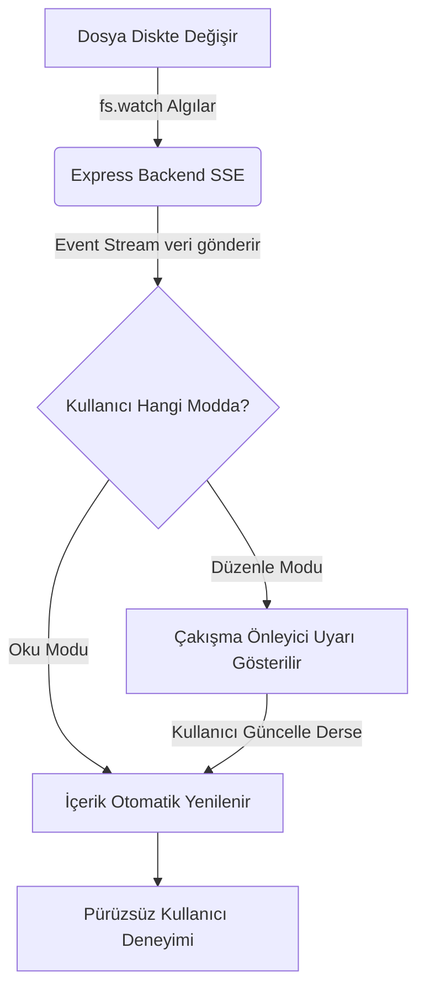
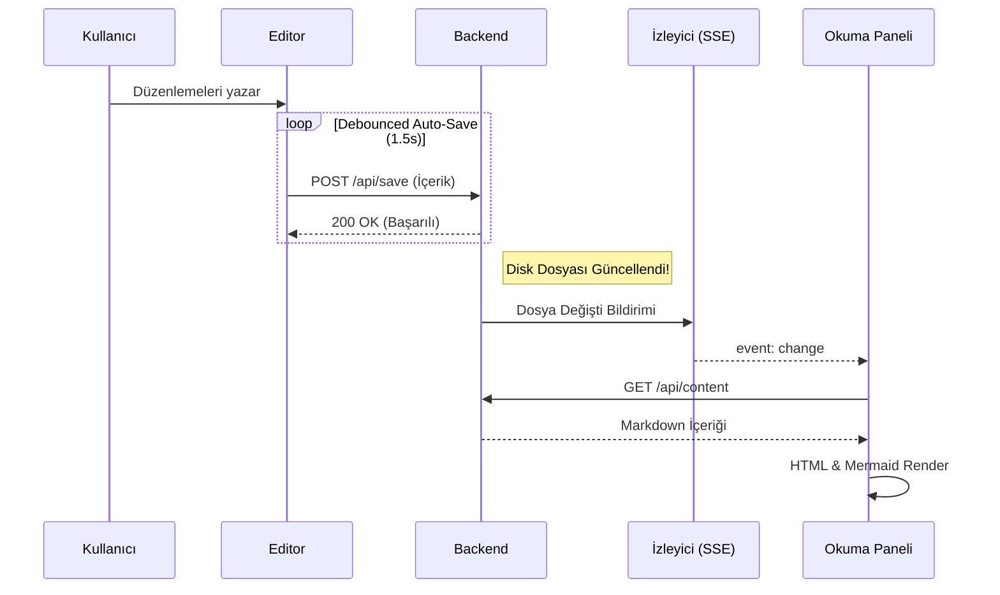

# 📝 MD Flow Viewer & Editor Demo

Hoş geldiniz! Bu belge, **MD Flow** profesyonel Markdown Viewer ve Editor uygulamasının tüm özelliklerini, yeteneklerini ve görsel tasarımlarını göstermek üzere tasarlanmıştır.

## 🚀 Temel Özellikler

Uygulamamız aşağıdaki temel özellikleri tamamen yerel ve yüksek performansla desteklemektedir:

*   **Dinamik İçindekiler (TOC):** Sol tarafta yer alan panel, dokümandaki başlıkları (`h1` - `h4`) otomatik olarak çıkarır. Tıklayarak başlığa pürüzsüzce kayabilirsiniz.
*   **Scroll-Spy (Kaydırma Takibi):** Dokümanı aşağı veya yukarı kaydırdıkça, sol taraftaki içindekiler listesinde o anda okuduğunuz başlık otomatik olarak vurgulanır.
*   **Çift Yönlü Toggle Arayüzü:** Sağ üst köşedeki **Oku / Düzenle** butonu ile anında mod değiştirebilirsiniz.
*   **Gerçek Zamanlı Canlı Takip:** Bu dosya bilgisayarınızda başka bir programla (örn. VS Code, Notepad) değiştirilirse, tarayıcı arayüzü **hiçbir yenileme yapmadan** içeriği arka planda günceller!
*   **Mermaid Diyagram Desteği:** Akış şemaları ve sekans şemalarını markdown içinde doğrudan çizdirebilirsiniz.
*   **Özel CSS Kod Gösterimleri:** Özel alert kutuları (`:::info`, `:::warning`, `:::danger`) ve istediğiniz CSS kuralları ile belgelerinize şıklık katabilirsiniz.

---

## 📊 Tablo ve Düzen Gösterimi

Aşağıda standart Markdown tablo formatının uygulamanın premium temasıyla nasıl göründüğü gösterilmiştir:

| Özellik Adı | Destek Durumu | Teknoloji | Açıklama |
| :--- | :---: | :--- | :--- |
| **Markdown Derleyici** | Evet | `marked.js` | Hızlı ve standartlara uyumlu derleme |
| **Kod Vurgulama** | Evet | `highlight.js` | Tokyo Night teması ile zengin renklendirme |
| **Diyagramlar** | Evet | `mermaid.js` | Dinamik SVG çizimleri |
| **Canlı Yenileme** | Evet | Node.js (SSE) | Arka plan dosya değişikliklerini anında alma |

---

## 🎨 Özel CSS Kutuları ve Tasarımlar

Markdown içinde `:::` blokları kullanarak özel alert/bilgi kutuları oluşturabilirsiniz. Bu özellik CSS özelleştirmesi ile tam uyumludur.

:::info
#### 💡 Bilgi Kutusu (:::info)
Bu alan önemli bilgileri, ipuçlarını ve ek notları kullanıcıya göstermek için idealdir. Arka planı hafif turkuaz tonlarındadır.
:::

:::warning
#### ⚠️ Uyarı Kutusu (:::warning)
Kullanıcının dikkat etmesi gereken, ancak kritik olmayan durumları veya tavsiyeleri belirtmek için bu kutuyu kullanabilirsiniz.
:::

:::danger
#### 🚨 Tehlike Kutusu (:::danger)
Kritik hataları, veri kaybı uyarılarını veya yapılması kesinlikle yasak olan durumları vurgulamak için tasarlanmıştır.
:::

---

## 🧬 Mermaid Diyagramları

Uygulama, kod blokları arasındaki Mermaid kodlarını yakalar ve tarayıcıda dinamik SVG grafiklerine dönüştürür.

### 1. İş Akış Şeması (Flowchart)

Aşağıdaki şema, dosyanın arka planda güncellenmesi ile tarayıcının tetiklenme sürecini görselleştirmektedir:



### 2. Sekans Şeması (Sequence Diagram)

İstemci ve sunucu arasındaki kaydetme ile SSE döngüsü:



---

## 💻 Kod Blokları ve Vurgulama

Aşağıda farklı yazılım dillerinde kodların nasıl renklendirildiği listelenmiştir.

### JavaScript Örneği

```javascript
// Sunucu tarafında SSE olayı fırlatma kodu
app.get('/api/watch', (req, res) => {
    res.writeHead(200, {
        'Content-Type': 'text/event-stream',
        'Cache-Control': 'no-cache',
        'Connection': 'keep-alive'
    });
    
    fs.watch(filePath, (event) => {
        if (event === 'change') {
            res.write('event: change\ndata: {"status": "updated"}\n\n');
        }
    });
});
```

### CSS Örneği

```css
/* Başlık hover animasyonu */
.markdown-body h2 {
    position: relative;
    transition: color 0.3s;
}
.markdown-body h2::after {
    content: '';
    position: absolute;
    bottom: -4px;
    left: 0;
    width: 30px;
    height: 3px;
    background: var(--accent-gradient);
    transition: width 0.3s;
}
.markdown-body h2:hover::after {
    width: 100%;
}
```

---

## 🛠️ Klavye Kısayolları

Düzenleme yaparken işinizi kolaylaştıracak klavye kısayolları tanımlanmıştır:

*   `Ctrl + S` : Değişiklikleri diske manuel olarak kaydeder.
*   `Ctrl + E` : **Oku** ve **Düzenle** modları arasında anında geçiş sağlar.
*   `Tab` : Düzenleyicide imlecin bulunduğu yere 4 boşluk girinti ekler.
